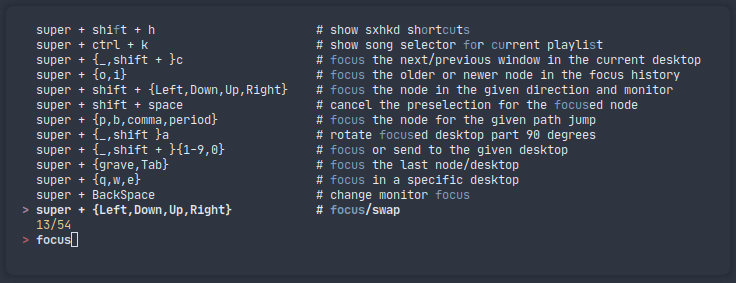

# fzf nord theme

This is a nord theme for fzf

# Code

```bash
export FZF_DEFAULT_OPTS=$FZF_DEFAULT_OPTS'
    --color=fg:#e5e9f0,bg:#2E3440,hl:#81a1c1
    --color=fg+:#e5e9f0,bg+:#2E3440,hl+:#81a1c1
    --color=info:#eacb8a,prompt:#bf6069,pointer:#b48dac
    --color=marker:#a3be8b,spinner:#b48dac,header:#a3be8b'
```

# Example


r